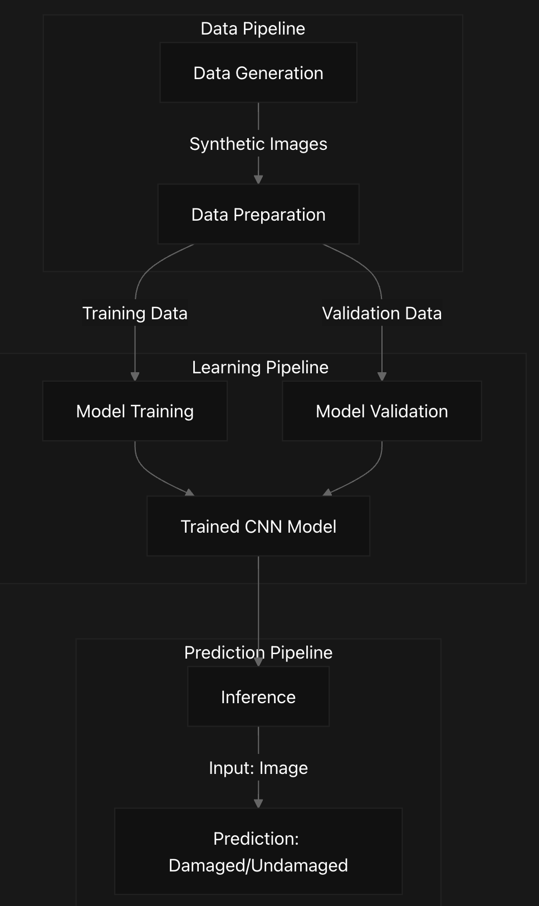
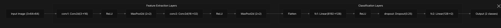
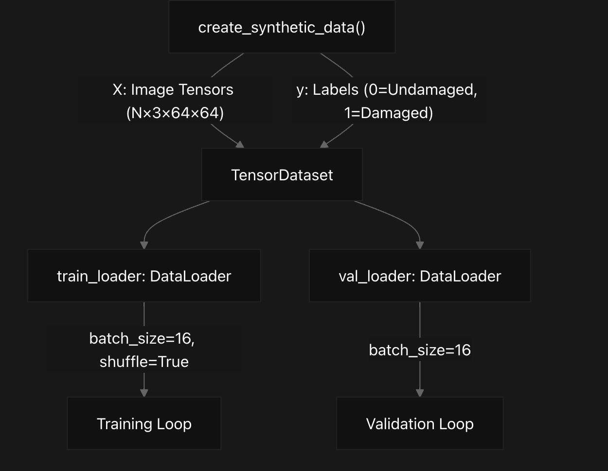
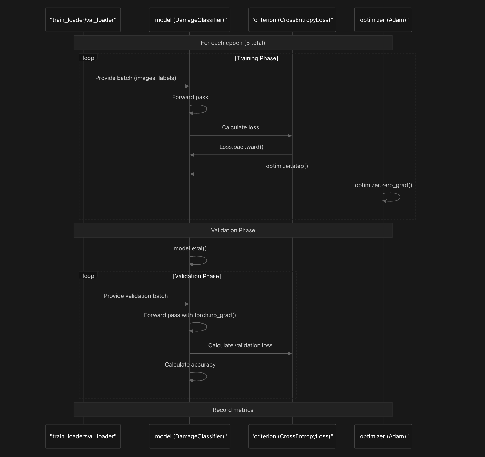
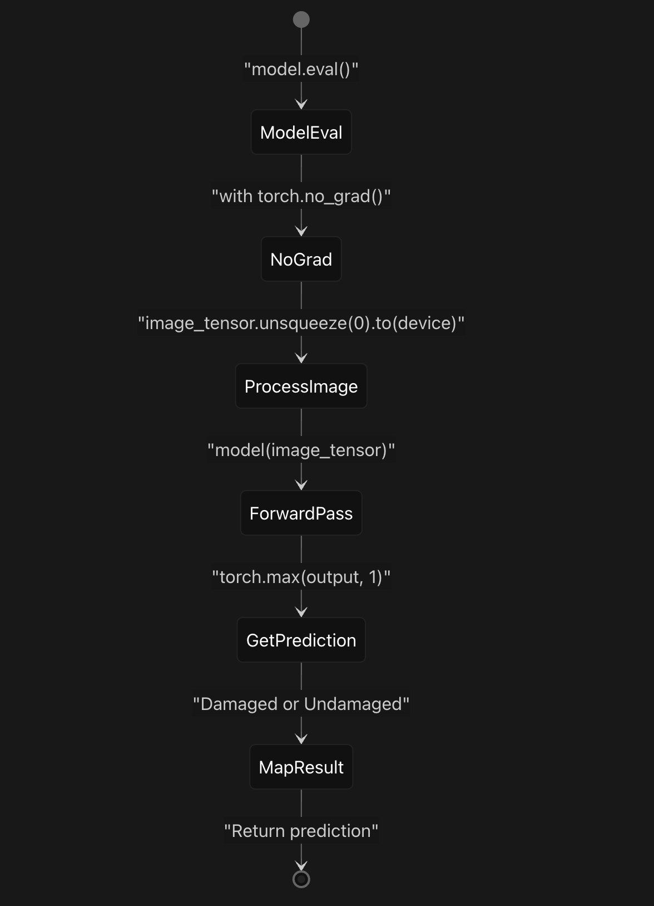
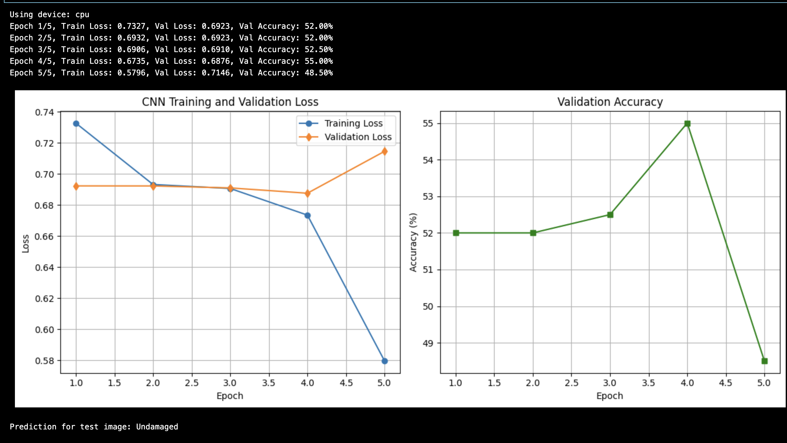

# CNN-Sim Overview
The CNN-Sim repository implements a convolutional neural network (CNN) system designed for automated product damage detection. This system classifies product images into two categories: "damaged" or "undamaged". Implemented entirely in PyTorch, the system offers a complete machine learning pipeline from data generation to model training and inference, all contained within a single Jupyter notebook.

## System Architecture
The CNN-Sim system consists of four primary components organized in a sequential pipeline, from data preparation to final inference.

The system implements a complete workflow that includes:
1. Data Generation: Creates synthetic image data simulating damaged and undamaged products
2. Data Preparation: Processes data into PyTorch datasets and dataloaders
3. Model Training: Trains the CNN using cross-entropy loss and Adam optimizer
4. Model Validation: Evaluates model performance on validation data
5. Inference: Uses the trained model to classify new product images

## CNN Model Architecture
The core of the system is the DamageClassifier class, which implements a convolutional neural network for binary image classification:

The model architecture consists of:
- Input Layer: Accepts 3-channel RGB images of size 64×64
- Convolutional Layers: Two convolutional layers with 16 and 32 filters respectively
- Pooling Layers: Max pooling to reduce spatial dimensions
- Fully Connected Layers: Transforms feature maps into class predictions
- Regularization: Dropout (25% rate) to prevent overfitting
- Output Layer: Two neurons representing the "damaged" and "undamaged" classes

## Data Pipeline
The CNN-Sim system uses synthetic data generation to create training and validation datasets, avoiding the need for real-world image data collection.

The data pipeline consists of:
1. Synthetic Data Generation: The create_synthetic_data() function produces random tensors simulating images with corresponding binary labels
2. Dataset Creation: Data is wrapped in PyTorch's TensorDataset objects
3. Data Loading: DataLoader objects provide batched data access with shuffling for training data

## Training Process
The training process implements standard supervised learning with gradient descent optimization:

Key training components include:
- Loss Function: Cross-entropy loss (nn.CrossEntropyLoss) for classification
- Optimizer: Adam optimizer with learning rate of 0.001
- Training Loop: Iterates through batches, computing gradients and updating weights
- Validation: Evaluates model performance on validation data after each epoch
- Metrics Tracking: Records training/validation loss and validation accuracy

## Inference Process
After training, the model can be used to classify new product images through the predict() function:

The inference process includes:
1. Preprocessing: Prepares the input image tensor
2. Forward Pass: Runs the image through the model
3. Prediction Extraction: Identifies the class with highest probability
4. Result Interpretation: Maps numerical prediction to human-readable label ("Damaged" or "Undamaged")

## System Implementation
The entire CNN-Sim system is implemented in a single Jupyter notebook, making it easy to understand and modify. The key components are:

Component	            Description	                                Code Location
create_synthetic_data()	Generates synthetic image data and labels	
                                                                    CNN.ipynb
                                                                    52-59
DamageClassifier	    CNN model architecture definition	
                                                                    CNN.ipynb
                                                                    72-101
Training Loop	        Implements model training and validation	
                                                                    CNN.ipynb
                                                                    117-158
Visualization	        Plots training/validation loss and accuracy	
                                                                    CNN.ipynb
                                                                    160-182
predict()	Function for making predictions on new images	
                                                                    CNN.ipynb
                                                                    184-197
The notebook is self-contained, handling all aspects from data generation to model training and inference, making it an excellent example of a complete deep learning pipeline for binary image classification.

## System Requirements and Setup
The implementation uses standard PyTorch libraries and components:
- PyTorch (torch)
- Neural network modules (torch.nn)
- Optimization algorithms (torch.optim)
- Data handling utilities (torch.utils.data)
- Visualization tools (matplotlib.pyplot)
- Numerical computing (numpy)

**Code Notebook:**
*Copy & Run* 
```
    import torch
    import torch.nn as nn
    import torch.optim as optim
    import matplotlib.pyplot as plt
    from torch.utils.data import TensorDataset, DataLoader
    import numpy as np

    #Create synthetic dataset for binary classification (simulating damaged/undamaged)
    def create_synthetic_data(num_samples=1000, input_size=64):
        # Create feature tensors (simulating images)
        X = torch.randn(num_samples, 3, input_size, input_size)
    
    # Create labels: 0 for undamaged, 1 for damaged
    y = torch.randint(0, 2, (num_samples,))
    
    return X, y

    #Generate data
    train_X, train_y = create_synthetic_data(1000)
    val_X, val_y = create_synthetic_data(200)
    
    #Create datasets and loaders
    train_dataset = TensorDataset(train_X, train_y)
    val_dataset = TensorDataset(val_X, val_y)
    
    train_loader = DataLoader(train_dataset, batch_size=16, shuffle=True)
    val_loader = DataLoader(val_dataset, batch_size=16)
    
    #CNN Model Definition
    class DamageClassifier(nn.Module):
        def __init__(self):
            super(DamageClassifier, self).__init__()
            self.conv1 = nn.Conv2d(3, 16, kernel_size=3, padding=1)
            self.conv2 = nn.Conv2d(16, 32, kernel_size=3, padding=1)
        
        # Calculate output size after convolutions and pooling
        # With padding=1, size is maintained after conv layers
        # After two 2x2 max pooling: 64 -> 32 -> 16
        feature_size = 16  # After 2 pooling layers on 64x64 input
        self.fc1 = nn.Linear(32 * feature_size * feature_size, 128)
        self.fc2 = nn.Linear(128, 2)  # Binary classification
        
        self.dropout = nn.Dropout(0.25)
    
    def forward(self, x):
        x = nn.functional.relu(self.conv1(x))
        x = nn.functional.max_pool2d(x, 2)
        x = nn.functional.relu(self.conv2(x))
        x = nn.functional.max_pool2d(x, 2)
        
        # Print shape for debugging - uncomment if needed
        # print(f"Shape before flattening: {x.shape}")
        
        x = x.view(x.size(0), -1)
        x = nn.functional.relu(self.fc1(x))
        x = self.dropout(x)
        x = self.fc2(x)
        return x

    #Device configuration
    device = torch.device('cuda' if torch.cuda.is_available() else 'cpu')
    print(f"Using device: {device}")
    
    model = DamageClassifier().to(device)
    criterion = nn.CrossEntropyLoss()
    optimizer = optim.Adam(model.parameters(), lr=0.001)
    
    #Training loop
    epochs = 5
    train_loss_history = []
    val_loss_history = []
    val_accuracy_history = []
    
    for epoch in range(epochs):
        #Training phase
        model.train()
        running_loss = 0.0
        for images, labels in train_loader:
            images, labels = images.to(device), labels.to(device)
        
        optimizer.zero_grad()
        outputs = model(images)
        loss = criterion(outputs, labels)
        loss.backward()
        optimizer.step()
        
        running_loss += loss.item()
    
    epoch_loss = running_loss / len(train_loader)
    train_loss_history.append(epoch_loss)
    
    # Validation phase
    model.eval()
    val_loss = 0.0
    correct = 0
    total = 0
    
    with torch.no_grad():
        for images, labels in val_loader:
            images, labels = images.to(device), labels.to(device)
            outputs = model(images)
            loss = criterion(outputs, labels)
            val_loss += loss.item()
            
            _, predicted = torch.max(outputs.data, 1)
            total += labels.size(0)
            correct += (predicted == labels).sum().item()
    
    val_epoch_loss = val_loss / len(val_loader)
    val_loss_history.append(val_epoch_loss)
    
    accuracy = 100 * correct / total
    val_accuracy_history.append(accuracy)
    
    print(f"Epoch {epoch+1}/{epochs}, Train Loss: {epoch_loss:.4f}, Val Loss: {val_epoch_loss:.4f}, Val Accuracy: {accuracy:.2f}%")

    #Visualization
    plt.figure(figsize=(12, 5))
    
    #Plot losses
    plt.subplot(1, 2, 1)
    plt.plot(range(1, epochs+1), train_loss_history, marker='o', label='Training Loss')
    plt.plot(range(1, epochs+1), val_loss_history, marker='d', label='Validation Loss')
    plt.title("CNN Training and Validation Loss")
    plt.xlabel("Epoch")
    plt.ylabel("Loss")
    plt.legend()
    plt.grid(True)
    
    #Plot validation accuracy
    plt.subplot(1, 2, 2)
    plt.plot(range(1, epochs+1), val_accuracy_history, marker='s', color='green')
    plt.title("Validation Accuracy")
    plt.xlabel("Epoch")
    plt.ylabel("Accuracy (%)")
    plt.grid(True)
    
    plt.tight_layout()
    plt.show()
    
    #Simple inference function
    def predict(model, image_tensor):
        model.eval()
        with torch.no_grad():
            image_tensor = image_tensor.unsqueeze(0).to(device)  # Add batch dimension
            output = model(image_tensor)
            _, predicted = torch.max(output, 1)
            result = "Damaged" if predicted.item() == 1 else "Undamaged"
        return result

    #Test inference with a random image
    test_image = torch.randn(3, 64, 64)
    prediction = predict(model, test_image)
    print(f"Prediction for test image: {prediction}")
```

